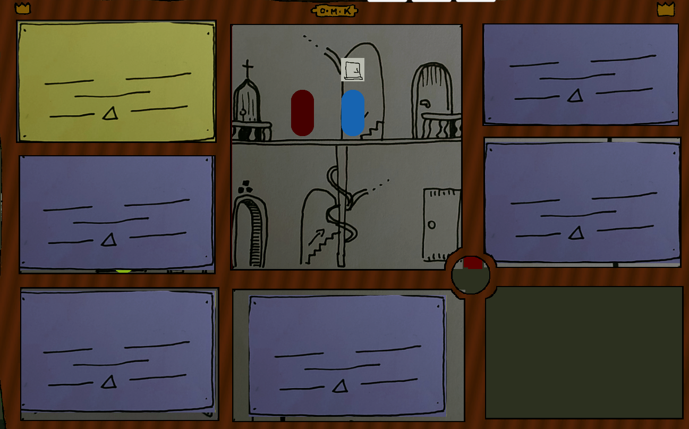

# Šperkovnice
## Description
It is a 2D game about searching items, soving puzzles and overcoming obstacles. Game is inspired by small minigame in a game Creaks. Whole game is just a box of eight rooms, but they are different for each character. For gathering necessary informations you have to search the enviroments and have dialogs with other characters.
## Preview of the game
This is how the game looks now. These are of course not the final visuals. They will be replaced with more detailed and polished versions later.

## Controls
Controls of the game are really simple. Whole game can be played on four keys. 
- A/D - moving your character to the left and right
- Space - interacting with enviroment, swapping character, etc.
- escape - for navigation in the menu

## Tools
- Unity (C#)
- Git for version control
- Textures are hand-drawn and scanned

## Credits
- Programming - Martin Konečný
- Visuals - Ondřej Marek